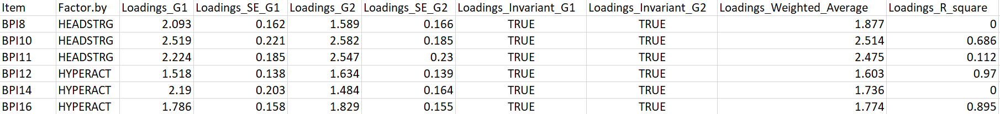
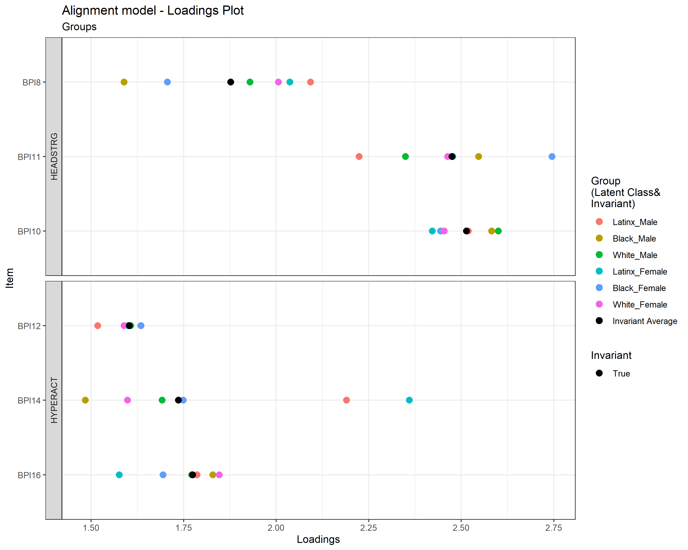
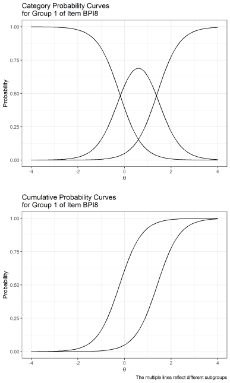

# harmony  

Harmony package helps to build the tables and plots from alignment analysis designed for the multi-factor categorical case by extracting the Mplus output's information.   

## Installing  
For Windows users, the `Rtools` for building R packages should be installed according to your R version from https://cran.r-project.org/bin/windows/Rtools/history.html.

### From GitHub

```
# install the development package devtools for installing packages from GitHub
install.packages("devtools")

# install harmony package from GitHub
devtools::install_github("hai-mn/harmony", dependencies = TRUE)
```

Then call the package:   
`library(harmony)`  

## Structure of The Package  
The `harmony` package has six main functions:  
- `alignmentout(infile = "", directory="")`: to generate table(s) with estimates, alignment values and R-square of Thresholds and Loadings  
- `alignmentthresholdplot(labelfile="", directory="")`: to generate alignment threshold plots having True/False invariant with estimates of group items and invariant average  
- `alignmentloadingplot(labelfile="", directory="")`: to generating alignment loading plot having True/False invariant with estimates of group items and invariant average  
- `convert2irt(directory="")`: to convert IFA estimates (threshold and loading) to IRT estimates (difficulty and discrimination)  
- `cpcCPC.csvexport(selected.item="", selected.group="", directory="")`: to produce the value grid of an item and a group of the category and cumulative probability curve
- `cpcCPC(selected.item="", selected.group="", directory="")`: to plot the Category and Cumulative Probability Curve of an item and one or multiple groups
- `cellsizedetect(infile="", n.detect="0", silent=TRUE)`: to check the 2 x 2 crosstabs of grouping variable and items having the cell size less than or equal to a specified number    

There are some supported functions enabling the main functions to properly work.  :
`paraextract(inputfile, begphrase, endphrase, outputfile)`,
`mplussplit(outpath = outpath, inputfile = inputfile)`,
`latentsplit(filepath = paste0("Output","_",Sys.Date()), inputfile = "ext4_model results.txt")`, and
`invariancesplit(inputfile="Invariant_Noninvariant.txt")`

## Suggestion for a Mplus Output Running with `harmony` Package

We recommend:  

- A Mplus output must have these parts:  
    1. INPUT INSTRUCTIONS
    2. SUMMARY OF ANALYSIS
    3. MODEL FIT INFORMATION
    4. MODEL RESULTS (including a part of <span style="color:red">APPROXIMATE MEASUREMENT INVARIANCE (NONINVARIANCE) FOR GROUPS</span>)  
    5. ALIGNMENT OUTPUT  
    6. SAVEDATA INFORMATION

    > To have APPROXIMATE MEASUREMENT INVARIANCE (NONINVARIANCE) FOR GROUPS part, an user must add a line in Mplus syntax (.inp):   
    <span style="color:blue">OUTPUT:</span> 	ALIGN;

- Avoiding comments in the Mplus syntax (phrases after "!" sign)   

- The label of groups in alignment plots generated by `alignmentplot` has to save in an Excel file with 2 column names:
  * __GroupNumber__: following the order in Mplus output, and
  * __GroupLabel__: equivalent name of each group

- A Mplus output must have a part of "CROSSTABS FOR CATEGORICAL VARIABLES" in order to `cellsizedetect()` correctly function.  
  > We have to add an option in Mplus syntax (.inp):   
  <span style="color:blue">OUTPUT:</span> CROSSTABS;

- Users can specify a directory folder (in the working directory) to save the output files. For instance, execute `alignmentout(infile="alignment-free.out", directory = "Harmony")`, then all the output files are saved in the "Harmony" folder which located in your working folder.  
If the directory argument in the functions is omitted, the program will set up its default folder "Output_date-is-today" to store the output files.

## Case Study

We demonstrated a case study of invariance analysis

### __Step 1:__ Install and load the `harmony` package

- In RStudio console (or in the Source panel), type then Enter (or Ctrl+Enter if in the Source panel):  
`install.packages("devtools")`  
`devtools::install_github("hai-mn/harmony", dependencies = TRUE)`  
`library(harmony)`  


### __Step 2:__ Generating alignment tables

- Set the working directory in which we want to store the output of tables and plots
`setwd("your-working-directory-here")`
- Put the Mplus output in the current working directory for convenience, here's the `alignment-free.out` Mplus output file.
- To generate the alignment tables, we call `alignmentout(infile="alignment-free.out")`
- The pop-up results in the console would be:
~~~
The function provides information from Mplus alignment output, including:
 - Groups (latent classes),
 - Factors (continuous latent variables),
 - Items (dependent variables) and
 - Categories of each Item (equal to Thresholds + 1).

In addition, you may find from the folder 'Output_current date' in the working directory:
 - the multiple text files which split from the origin Mplus output
 - the thresholds, loadings tables (CSV format) and
 - especially, a combined Excel file with all separated spreadsheets
Enter path and Mplus output file (separated by /): your-path-file-here/Tutorial-Alignment-Free.out
- The Number of Groups (Latent Classes): 6
- The Name of Groups (Latent Classes): subgroup with categories of 1 2 3 4 5 6
- The Number of Factors: 2 ,including  HEADSTRO HYPERACT
- The Number of Items:  6 ,including:  BPI8 BPI10 BPI11 BPI12 BPI14 BPI16
- The Number of Categories and Threshold in each Item:
 Item.name Category Threshold
      BPI8        3         2
     BPI10        3         2
     BPI11        3         2
     BPI12        3         2
     BPI14        3         2
     BPI16        3         2
~~~

Note: if you enter all the path file and Mplus output file, it should be separated by / or \\\\. For example, `"C:/User/JohnD/Mplus/alignment-free.out"`
- We can check the output at folder "Output_day-is-today" in the working directory having: "threshold1.csv", "threshold2.csv", and "loadings.csv".   
- Here is the Mplus code:

~~~
TITLE: 		Alignment (free)
DATA: 		FILE = NLSYPSIDbpi.dat ;
VARIABLE:	NAMES = subgroup
                        bpi8 bpi10 bpi11
                        bpi12 bpi14 bpi16
                        childid ;
                CATEGORICAL = bpi8 bpi10 bpi11
                              bpi12 bpi14 bpi16 ;
                IDVARIABLE = childid ;
                CLASSES = c(6) ;
                KNOWNCLASS = c(subgroup = 1 2 3 4 5 6 ) ;
ANALYSIS:       TYPE = MIXTURE ;
                ESTIMATOR = MLR ;
                LINK = LOGIT ;
                ALIGNMENT = FREE(Configural) ;
                ALGORITHM = INTEGRATION ;
OUTPUT: 	ALIGN ;
SAVEDATA: 	file is alignment-free.txt ;
MODEL: 	        %OVERALL%
                Headstrong BY bpi8 ;
                Headstrong BY bpi10 ;
                Headstrong BY bpi11 ;
                Hyperactive BY bpi12 ;
                Hyperactive BY bpi14 ;
                Hyperactive BY bpi16 ;
                Headstrong with Hyperactive ;
~~~
- The loadings table looks like:



We call the functions:
`alignmentthresholdplot(labelfile="group label.xlsx")` to plot alignment thresholds plots
`alignmentloadingplot(labelfile="group label.xlsx")` to plot alignment loadings plot

Here's in the argument of these plot functions, we provide an Excel file `group label.xlsx` storing the information of groups:

| GroupNumber | GroupLabel   |
|-------------|--------------|
|1		        |Latinx_Male   |
|2		        |Black_Male    |
|3		        |White_Male    |
|4		        |Latinx_Female |
|5		        |Black_Female  |
|6		        |White_Female  |

The functions would notify:  

```
Exporting "alignment model - Threshold1 - 6 groups.tiff" in "../Output_date" folder
Exporting "alignment model - Threshold2 - 6 groups.tiff" in "../Output_date" folder
```

and

```
Exporting "alignment model - Loadings - 6 groups.tiff" in "../Output_date" folder   
```
Here's an example of alignment loadings plot we can find in the Output_date folder:   




### __Step 3:__ Convert Item Factor Analysis (IFA) estimates to Item Response Theory (IRT) estimates

Execute `convert2irt()` to convert the IFA to IRT.

The functions would notify in the console:

```
Exporting "group_factor means and variances.csv" in "../Output_date" folder
Exporting "discriminations.csv" in "../Output_date" folder
Exporting "difficulty1.csv" in "../Output_date" folder
Exporting "difficulty2.csv" in "../Output_date" folder
```

If we need the value generated from Categorical (cpc) and Cumulative (CPC) Probability Curve respective to 0.1 unit increasing of `Theta` from -4 to 4; we can execute
`cpcCPC.csvexport(selected.item="", selected.group="")` with selecting an item and a group at a time.

For example, we execute
`cpcCPC.csvexport(selected.item='BPI8', selected.group='1')`

The function would notify in the console:

```
The program exports the value grid of Item Probability Curve on the selected item and its group
Exporting "Item Probability Curve (IPC) of BPI8 - Group 1.csv" in "../Output_date" folder
```

We can see in the "Out_date" folder a file name of "IPC of BPI8 - G 1.csv".


### __Step 4:__ Generating category and cumulative probability curves
Finally, we execute `cpcCPC(selected.item="", selected.group="")` with selecting an item and one group or multiple groups at a time.

For example, we execute
`cpcCPC(selected.item='BPI8', selected.group='1, 3, 5')`

There would be informed lines in the console:

```
The function plots cumulative and category probability curves on the selected item and group(s)
Exporting "PC of Item BPI8 - Group 1, 3, 5.tiff" in "../Output_date" folder  
```

The plot would be:  



### __Step 5:__ Detect the zero cell size in crosstabs for categorical variables

We use another Mplus output which had a "CROSSTABS FOR CATEGORICAL VARIABLES" part.

Execute `cellsizedetect(infile="basic-crosstabs.out", n.detect="0", silent = TRUE)`  
Here we provided a Mplus output file "basic-crosstabs.out" in the `infile` and the zero number of cell size in `n.detect` argument, i.e. we want to detect in the crosstabs. `silent` = TRUE (default option) which means crosstabs will not print out.

In the console, there would be informed lines:

```
No cell size equal (or below) 0
```

__Notice:__
We can provide any specific number (other than zero) in the `n.detect` argument.

## Example Mplus files
Here is the list of files used in the case study:
- [alignment-free.txt](https://github.com/hai-mn/harmony/blob/master/docs/alignment-free.txt): dataset
- [alignment-free.inp](https://github.com/hai-mn/harmony/blob/master/docs/alignment-free.inp): Mplus syntax file
- [alignment-free.out](https://github.com/hai-mn/harmony/blob/master/docs/alignment-free.out): Mplus output file
- [basic-crosstabs.out](https://github.com/hai-mn/harmony/blob/master/docs/basic-crosstabs.out): Mplus output file


## Acknowledgment

This package is based on the work supported by the Eunice Kennedy Shriver National Institute Of Child Health & Human Development of the National Institutes of Health under Award Number R03HD098310. The content is solely the responsibility of the authors and does not necessarily represent the official views of the National Institutes of Health.
