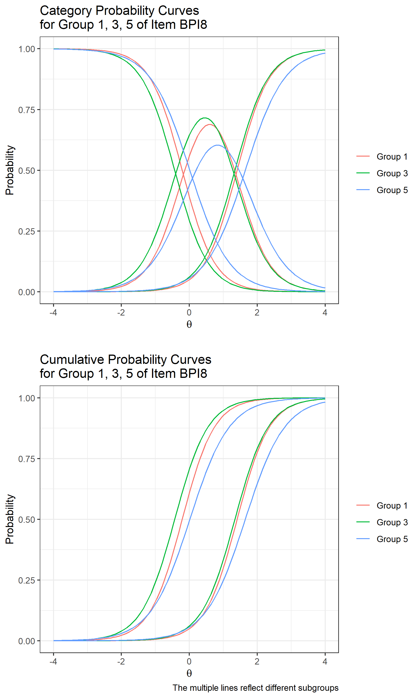

# harmony  

Harmony package helps to build the tables and plots from alignment analysis designed for the multi-factor categorical case by extracting the Mplus output's information.   

## Installing  

To install, type in the RStudio console:    
`devtools::install_github("hai-mn/harmony")`  

Note that:  
- code in R is case-sensitive, so capitalization is essential.    
- harmony package requires some other dependent packages (tidyverse, data.table, readxl, openxlsx, latex2exp, scales, ggpubr) in order to correctly execute. That's the reason we suggest users should install the package with the `dependencies = TRUE` option, such that

  `devtools::install_github("hai-mn/harmony", dependencies = TRUE)`

  So that users do not need to install the required packages themselves manually.   

Then call the package:   
`library(harmony)`  

## Structure of The Package  
The `harmony` package has six main functions:  
- `alignmentout()`: to generate table(s) with estimates, alignment values and R-square of Thresholds and Loadings  
- `alignmentthresholdplot()`: to generate alignment threshold plots having True/False invariant with estimates of group items and invariant average  
- `alignmentloadingplot()`: to generating alignment loading plot having True/False invariant with estimates of group items and invariant average  
- `convert2irt()`: to convert IFA estimates (threshold and loading) to IRT estimates (difficulty and discrimination)  
- `irc.csvexport()`: to produce the value grid to plot category and cumulative probability curve
- `irc()`: to generate Cumulative and Category Item Probability (Characteristic/Response) Curve Plots  
- `cellsizedetect()`: to check the 2 x 2 crosstabs of items having the cell size and below specified by the user    

There are some supported functions enabling the main functions to properly work.  :
`paraextract(inputfile, begphrase, endphrase, outputfile)`,
`mplussplit(outpath = outpath, inputfile = inputfile)`,
`latentsplit(filepath = paste0("Output","_",Sys.Date()), inputfile = "ext4_model results.txt")`, and
`invariancesplit(inputfile="Invariant_Noninvariant.txt")`

## Strongly suggestion for a Mplus output running with `harmony` package
We recommend:  

- A Mplus output must have these parts:  
    1. INPUT INSTRUCTIONS
    2. SUMMARY OF ANALYSIS
    3. MODEL FIT INFORMATION
    4. MODEL RESULTS (including a part of APPROXIMATE MEASUREMENT INVARIANCE (NONINVARIANCE) FOR GROUPS)  
    5. ALIGNMENT OUTPUT  
    6. SAVEDATA INFORMATION

    To have APPROXIMATE MEASUREMENT INVARIANCE (NONINVARIANCE) FOR GROUPS part, an user must add a line in Mplus syntax (.inp):   
    OUTPUT: 	ALIGN;

- Avoid comments in the Mplus syntax (phrases after "!" sign)   

- the labeling for alignment plots generated by `alignmentplot()` has to save in an Excel file with 2 column names: __GroupNumber__ and __GroupLabel__

## Case Study

We demonstrated a case study of invariance analysis

__Step 1:__ Install and load the `harmony` package
- In RStudio console (or in the Source panel), type then Enter (or Ctrl+Enter if in the Source panel):
`devtools::install_github("hai-mn/harmony")`
`library(harmony)`

__Step 2:__ Generating alignment tables
- Set the working directory in which we want to store the output of tables and plots
`setwd("your-working-directory-here")`
- To generate the alignment tables, we call `alignmentout()`
- The pop-up results in the console would be:
~~~
The function provides information from Mplus alignment output, including:
 - Groups (latent classes),
 - Factors (continuous latent variables),
 - Items (dependent variables) and
 - Categories of each Item (equal to Thresholds + 1).

In addition, you may find from the folder 'Output_current date' in the working directory:
 - the multiple text files which split from the origin Mplus output
 - the thresholds, loadings tables (CSV format) and
 - especially, a combined Excel file with all separated spreadsheets
Enter path and Mplus output file (separated by /): your-path-file-here/Tutorial-Alignment-Free.out
- The Number of Groups (Latent Classes): 6
- The Name of Groups (Latent Classes): subgroup with categories of 1 2 3 4 5 6
- The Number of Factors: 2 ,including  HEADSTRO HYPERACT
- The Number of Items:  6 ,including:  BPI8 BPI10 BPI11 BPI12 BPI14 BPI16
- The Number of Categories and Threshold in each Item:
 Item.name Category Threshold
      BPI8        3         2
     BPI10        3         2
     BPI11        3         2
     BPI12        3         2
     BPI14        3         2
     BPI16        3         2
~~~
- Enter the path file and file name when the function requests:
"_your-path-file-here/Tutorial-Alignment-Free.out_"
Note: path file should be separated by / or \\\\
- The user can check the output at folder "Output_day-is-today" in the working directory: "threshold1.csv", "threshold2.csv", "loadings.csv", and ""
- Mplus code would look like (__should not have any comments__):
~~~
TITLE: 		Alignment (free)
DATA: 		FILE = NLSYPSIDbpi.dat ;
VARIABLE:	NAMES = subgroup
                        bpi8 bpi10 bpi11
                        bpi12 bpi14 bpi16
                        childid ;
                CATEGORICAL = bpi8 bpi10 bpi11
                              bpi12 bpi14 bpi16 ;
                IDVARIABLE = childid ;
                CLASSES = c(6) ;
                KNOWNCLASS = c(subgroup = 1 2 3 4 5 6 ) ;
ANALYSIS:       TYPE = MIXTURE ;
                ESTIMATOR = MLR ;
                LINK = LOGIT ;
                ALIGNMENT = FREE(Configural) ;
                ALGORITHM = INTEGRATION ;
OUTPUT: 	ALIGN ;
SAVEDATA: 	file is alignment-free.txt ;
MODEL: 	        %OVERALL%
                Headstrong BY bpi8 ;
                Headstrong BY bpi10 ;
                Headstrong BY bpi11 ;
                Hyperactive BY bpi12 ;
                Hyperactive BY bpi14 ;
                Hyperactive BY bpi16 ;
                Headstrong with Hyperactive ;
~~~
- The loadings table looks like:

__Step 3:__ Generating alignment plots
For example, we call the function: `alignmentloadingplot()` to plot alignment loadings plot

In the console, we enter a file which has group label:

Input the label file for groups (y/n)?y
Input path and legend's label file name (use /): ../group label.xlsx

The function would notify:
Exporting "alignment model - Loadings - 6 groups.tiff" in "../Output_2021-04-09" folder

Here's the plot:

__Step 4:__ Convert (Item Factor Analysis) IFA estimates to (Item Response Theory) IRT estimates

Execute `convert2irt()` to convert the IFA to IRT. But if the user would need the value to their own need, they should execute `irc.csvexport()` with selecting the item and a certain group.

__Step 5:__ Generating category and cumulative probability curves
Finally, we execute `irc()`. There would be informed lines in Console:
The function plots cumulative and category probability curves on the selected item and group(s)
Input an item need to be plotted:  

1: BPI8
2: BPI10
3: BPI11
4: BPI12
5: BPI14
6: BPI16

Selection: 1
Input the Group(s):  

1: 1
2: 2
3: 3
4: 4
5: 5
6: 6
7: Other Combination

Selection: 1
Exporting "IRC of Item BPI8 - Group 1.tiff" in "../Output_2021-04-09" folder

The plot looks like:

### Example Mplus files
Here is the list of files used in the case study:
- [alignment-free.txt](https://github.com/hai-mn/harmony/blob/master/docs/alignment-free.txt): dataset
- [alignment-free.inp](https://github.com/hai-mn/harmony/blob/master/docs/alignment-free.inp): Mplus syntax file
- [alignment-free.out](https://github.com/hai-mn/harmony/blob/master/docs/alignment-free.out): Mplus output file

## Acknowledgment

Research reported in this publication was supported by the Eunice Kennedy Shriver National Institute Of Child Health & Human Development of the National Institutes of Health under Award Number R03HD098310. The content is solely the responsibility of the authors and does not necessarily represent the official views of the National Institutes of Health.
